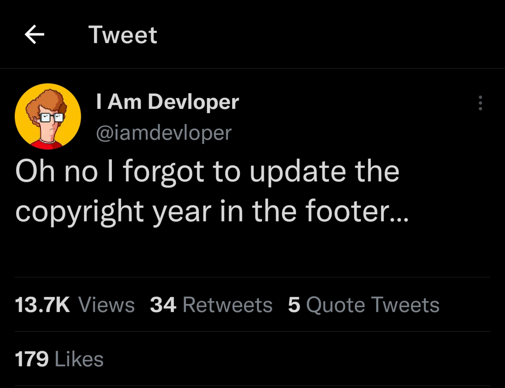

#TimeDateMonthYear

If you need the current hour, day or year, TDMY has you covered. Need to know the current hour in any valid timezone? Need to keep that year up to date in your footer? Need to know the day? 

Dont be one of those developers who uses the wrong date. Use TDMY.

`/api/beats`

Returns the current time in beats. Beat time is a decimal time concept by Swatch. Rather than hours, minutes and seconds, beat time is measured in beats. A beat is 86.4 seconds and 1 day is 1000 beats.